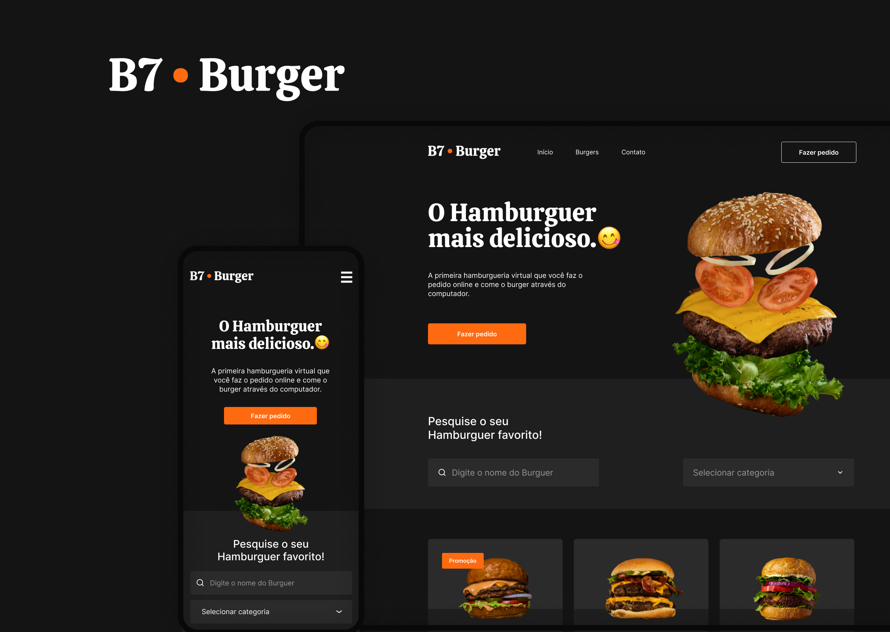

<h1 align="center">Projeto B7Web Burger | React JS</h1>

<h2 align="center">Sobre</h2>

Esse projeto foi desenvolvido para por em prática o meu aprendizado em React JS.</a>

 

  <a href="#-tecnologias">Tecnologias</a>&nbsp;&nbsp;&nbsp;|&nbsp;&nbsp;&nbsp;
  <a href="#-projeto">Projeto</a>&nbsp;&nbsp;&nbsp;|&nbsp;&nbsp;&nbsp;
  <a href="#-layout">Layout</a>&nbsp;&nbsp;&nbsp;|&nbsp;&nbsp;&nbsp;
  <a href="#memo-licença">Licença</a>

  

 

  

## 🚀 Tecnologias

Esse projeto foi desenvolvido com as seguintes tecnologias:

- React JS
- React Router Dom
- React Icons
- CSS Modules
- Figma

## 💻 Projeto

- [Visite o projeto online](https://kelvinymickael.github.io/B7BURGER/)

## 🔖 Layout

Você pode visualizar o layout do projeto através [DESSE LINK](https://www.figma.com/file/LNiScTkRfHfVKSFzSWnmic/Projeto-B7Burger?type=design&t=VNlqAXASAjFeBO0Y-6). É necessário ter conta no [Figma](https://figma.com) para acessá-lo.

## :memo: Licença

Esse projeto está sob a licença MIT.

---

Developed By Kelviny Mickael.
